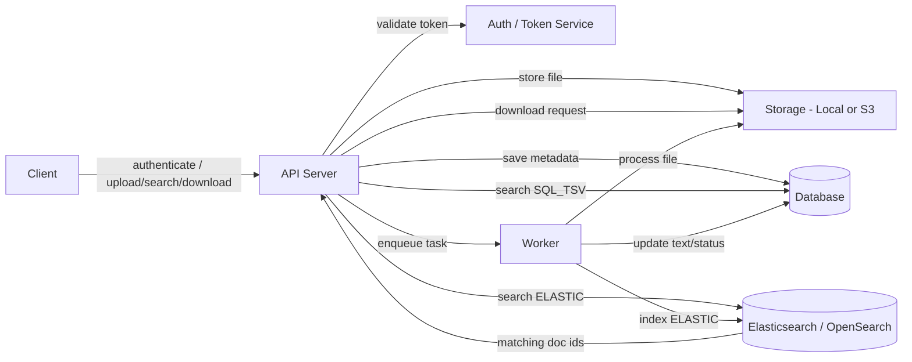

# Document Management Architecture

This document describes the request/response lifecycle for uploads, search, and downloads in the FastAPI document management POC.

## Overview

The application supports two kinds of storage:

- `local`: files are kept on the server filesystem under `uploads/`
- `s3`: files are uploaded to an S3-compatible object store

The API also enforces bearer token authentication and document sharing permissions.

It also supports hybrid processing:

- small files are processed synchronously during upload
- larger or expensive uploads are deferred to a Celery worker

## Process flow diagram

This diagram is expressed in Mermaid syntax for compatibility with supported Markdown previewers. If your VS Code preview does not render Mermaid, the source remains visible for reference.

## Upload lifecycle

### 1. Client request

Client sends `POST /upload` with:

- `file` as multipart upload
- Bearer token in `Authorization`

### 2. API server handles upload

1. `main.upload_document()` receives the file in FastAPI.
2. The file is written to a local temporary path via `utils.save_upload_file()`.
3. The server checks the file size against `PROCESSING_SYNC_SIZE_LIMIT_BYTES`.

### 3. Synchronous path (small files)

If the file size is below the configured threshold and background processing is not forced:

1. The server extracts text via `utils.extract_text_from_file()`.
2. The extracted text is saved into `Document.search_text`.
3. The document metadata row is inserted into the database with `status = processed`.
4. File storage is finalized via `storage.save_to_storage()`.
5. The response returns `status: processed`.

### 4. Asynchronous path (large files)

If the file size exceeds the threshold, or `FORCE_BACKGROUND_PROCESSING=true`:

1. The server stores the file immediately in the selected backend.
2. The database row is created with `status = pending` and no `search_text` yet.
3. A Celery task is queued through `tasks.process_document.delay(document.id)`.
4. The response returns `status: pending`.

### 5. Worker processing

The Celery worker executes `process_document(document_id)`:

1. It loads the document row from the database.
2. If the file is stored on S3, it downloads the object to a temporary local path.
3. It extracts text with `utils.extract_text_from_file()`.
4. It updates the document record with `search_text` and `status = processed`.
5. If the worker fails, `status` becomes `failed` and `error_message` is recorded.

## Versioning lifecycle

`POST /documents/{id}/versions` creates a new document version from an existing record.

1. The API resolves the base document by `id`.
2. It looks up the current version for the same `group_id`.
3. If `expected_version_id` is provided and does not match the current version's `id`, the API returns `409 Conflict` with the latest version metadata.
4. The previous current version is marked `is_current = False`.
5. A new document record is created with:
   - the same `group_id`
   - `version_number` incremented by 1
   - `base_version_id` set to the previous current version's `id`
   - `is_current = True`
6. The storage and search processing flow remains the same, but the new version becomes the active current document.

### Current-version behavior

- `GET /documents` returns only records where `is_current = True`.
- `GET /documents/{id}/versions` returns all versions that belong to the same `group_id`.
- `GET /documents/{id}` returns metadata for the requested version, current or historical.

## Authentication and permissions lifecycle

The API requires bearer token authentication for document operations.

1. The client obtains a token by POSTing credentials to `POST /token`.
2. The first user can be created with `POST /users` without prior authentication; subsequent user creation requires an admin token.
3. Each protected endpoint validates the bearer token and resolves the current user.
4. Document owners and users with explicit permissions can access metadata, download files, and search versions.
5. Sharing permissions are managed through `POST /documents/{id}/share`, `DELETE /documents/{id}/share`, and `GET /documents/{id}/permissions`.
6. Search results are filtered by the user’s allowed document groups.

## Search lifecycle

Client requests `GET /search?q=keyword`.

1. The API selects a search backend based on `SEARCH_BACKEND`.
2. If the backend is `sql`, it searches with `ILIKE` over `Document.filename` and `Document.search_text`.
3. If the backend is `tsvector`, it uses PostgreSQL `to_tsvector()` and `plainto_tsquery()` for full-text matching.
   - During startup, `init_db()` will also create a PostgreSQL GIN index on that
     generated tsvector expression when it detects a PostgreSQL database URL.
4. If the backend is `elastic`, it queries Elasticsearch/OpenSearch and resolves matching document IDs from the database.
5. The API returns matching document metadata.

This search implementation is intentionally pluggable so the maintainer can choose between simple SQL search, PostgreSQL full-text search, or a dedicated search engine.

## Download lifecycle

Client requests `GET /download/{document_id}`.

1. The API resolves the document row from the database.
2. If the document uses local storage, it returns `FileResponse(path=document.path)`.
3. If the document uses S3, it streams the object via `storage.download_from_s3()`.

## Document state model

The `Document` model includes:

- `id`
- `filename`
- `content_type`
- `owner`
- `size`
- `path` (local path or S3 key)
- `storage_backend` (`local` or `s3`)
- `status` (`pending`, `processed`, `failed`)
- `error_message`
- `search_text`
- `group_id`
- `version_number`
- `is_current`
- `base_version_id`
- `created_at`
- `updated_at`

Sharing permissions are stored in a separate `document_permissions` table mapping `group_id` to users with `read` or `write` access.

## Configuration points

- `STORAGE_BACKEND`: `local` or `s3`
- `S3_BUCKET`, `S3_REGION`, `S3_ENDPOINT_URL`
- `DATABASE_URL`: SQLite or PostgreSQL connection URL
- `PROCESSING_SYNC_SIZE_LIMIT_BYTES`: size threshold for synchronous processing
- `FORCE_BACKGROUND_PROCESSING`: force worker execution for all uploads
- `CELERY_BROKER_URL` and `CELERY_RESULT_BACKEND`: Celery configuration

## Recommended deployment

- Run FastAPI behind a process manager or ASGI server.
- Run a separate Celery worker process for async document processing.
- Use PostgreSQL in production for metadata.
- Use an S3-compatible object store for files if multiple API instances share storage.
